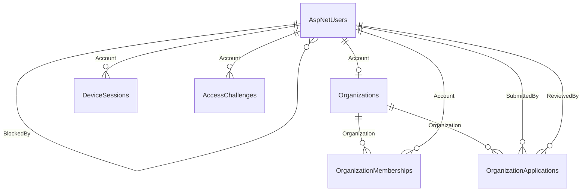
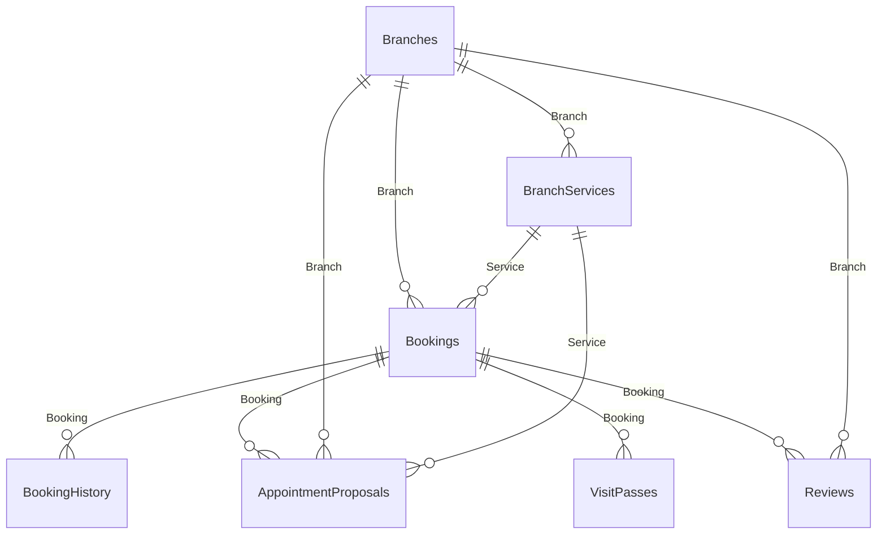
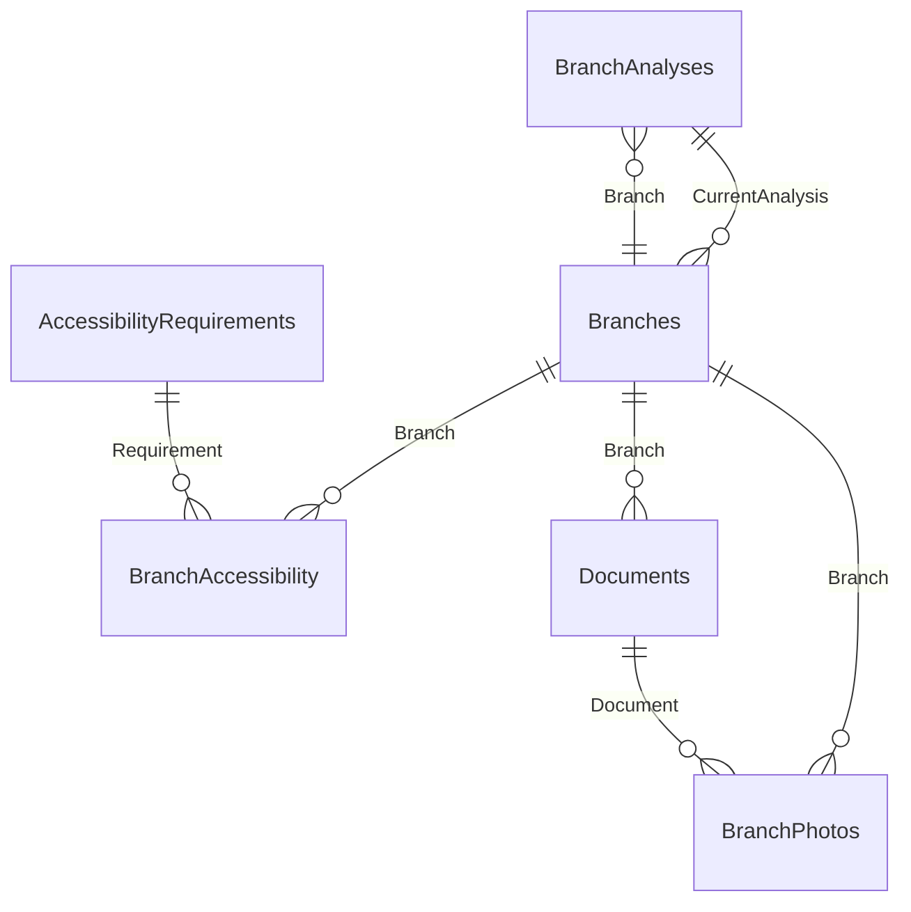
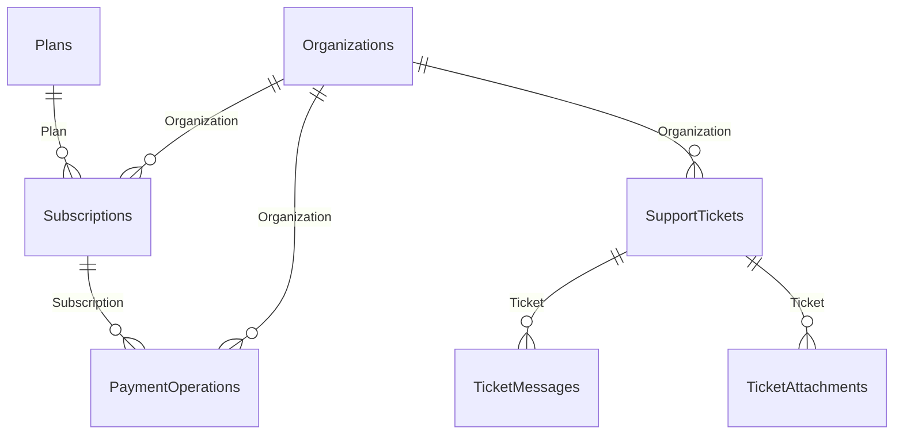

# Relationship diagrams

Not every table is shown in each diagram. The complete authoritative inventory is `schema.json`.

## Accounts

```mermaid
erDiagram
    AspNetUsers ||--o{ AspNetUsers : "BlockedBy"
    AspNetUsers ||--o| Organizations : "Account"
    Organizations ||--o{ OrganizationMemberships : "Organization"
    AspNetUsers ||--o{ OrganizationMemberships : "Account"
    Organizations ||--o{ OrganizationApplications : "Organization"
    AspNetUsers ||--o{ OrganizationApplications : "SubmittedBy"
    AspNetUsers ||--o{ OrganizationApplications : "ReviewedBy"
    AspNetUsers ||--o{ DeviceSessions : "Account"
    AspNetUsers ||--o{ AccessChallenges : "Account"
```

## Visits

```mermaid
erDiagram
    Branches ||--o{ BranchServices : "Branch"
    Branches ||--o{ Bookings : "Branch"
    BranchServices ||--o{ Bookings : "Service"
    Bookings ||--o{ BookingHistory : "Booking"
    Bookings ||--o{ AppointmentProposals : "Booking"
    Branches ||--o{ AppointmentProposals : "Branch"
    BranchServices ||--o{ AppointmentProposals : "Service"
    Bookings ||--o{ VisitPasses : "Booking"
    Bookings ||--o{ Reviews : "Booking"
    Branches ||--o{ Reviews : "Branch"
```

## Evidence

```mermaid
erDiagram
    BranchAnalyses ||--o{ Branches : "CurrentAnalysis"
    Branches ||--o{ BranchAccessibility : "Branch"
    AccessibilityRequirements ||--o{ BranchAccessibility : "Requirement"
    Branches ||--o{ Documents : "Branch"
    Branches ||--o{ BranchPhotos : "Branch"
    Documents ||--o{ BranchPhotos : "Document"
    Branches ||--o{ BranchAnalyses : "Branch"
```

## Operations

```mermaid
erDiagram
    Organizations ||--o{ Subscriptions : "Organization"
    Plans ||--o{ Subscriptions : "Plan"
    Organizations ||--o{ PaymentOperations : "Organization"
    Subscriptions ||--o{ PaymentOperations : "Subscription"
    Organizations ||--o{ SupportTickets : "Organization"
    SupportTickets ||--o{ TicketMessages : "Ticket"
    SupportTickets ||--o{ TicketAttachments : "Ticket"
```
