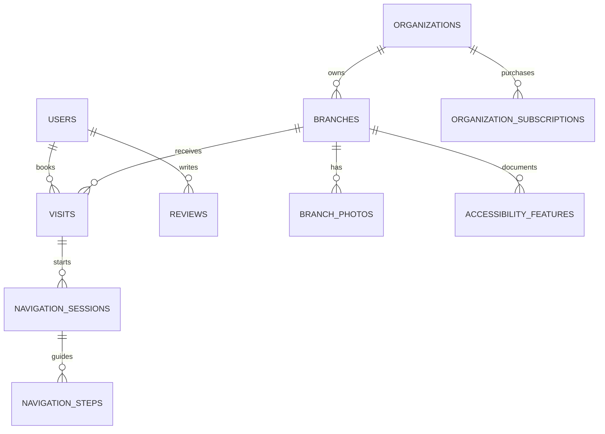

# Wusool SQL Server Database Guide

## النتيجة

تم تصميم قاعدة البيانات بالاعتماد على صفحات وأكواد مشروع Wusool الكامل: `visitor` و`user` و`org` و`admin`.

- قاعدة البيانات: `WusoolDB`
- المحرك: Microsoft SQL Server 2019 أو أحدث
- عدد الجداول: 82 جدولًا
- Views جاهزة: 3
- تشمل العلاقات، القيود، الفهارس والبيانات المرجعية الأساسية

## طريقة التشغيل

1. افتح **SQL Server Management Studio (SSMS)**.
2. اتصل بـ SQL Server.
3. افتح الملف `WusoolDB_Full.sql`.
4. اضغط **Execute**.
5. حدّث قائمة Databases وستظهر قاعدة `WusoolDB`.

> شغّل الملف مرة واحدة على قاعدة جديدة. بيانات الاختبار الفعلية تُضاف لاحقًا من الـBackend أو ملف Seed منفصل.

## ربط واجهات المشروع بالجداول

| جزء المشروع | أهم الجداول |
|---|---|
| التسجيل وتسجيل الدخول | `Users`, `Roles`, `UserRoles`, `UserSessions`, `PasswordResetTokens` |
| بروفايل المستخدم وCV | `UserProfiles`, `UserAccessibilityPreferences`, `AccessibilityNeedTypes` |
| تسجيل المؤسسة والموافقة | `Organizations`, `OrganizationUsers`, `OrganizationDocuments`, `OrganizationApprovalHistory` |
| الاشتراك والدفع | `SubscriptionPlans`, `PlanFeatures`, `OrganizationSubscriptions`, `PaymentTransactions` |
| الفروع | `Branches`, `Services`, `BranchServices`, `BranchWorkingHours`, `BranchSpecialHours` |
| وصول الفرع وصوره | `AccessibilityFeatures`, `BranchAccessibilityFeatures`, `BranchPhotos` |
| إرسال الفرع للمراجعة | `BranchSubmissions`, `BranchSubmissionHistory` |
| تقارير AI للمؤسسة | `AIAnalysisReports`, `AIAnalysisFindings` |
| البحث والخريطة وتفاصيل المكان | `vw_PublicBranches` مع جداول الفروع والوصول والصور |
| الحجز والزيارات | `Visits`, `VisitSupportNeeds`, `VisitStatusHistory` |
| الملاحة الداخلية بالصور | `NavigationSessions`, `NavigationPhotos`, `NavigationSteps`, `NavigationHazards` |
| الأماكن المحفوظة والمقارنة | `SavedPlaces`, `ComparisonLists`, `ComparisonListItems` |
| تقييمات المستخدمين | `Reviews`, `ReviewAccessibilityFeatures`, `ReviewPhotos` |
| بلاغات مشاكل الوصول | `AccessibilityIssueReports`, `IssueReportPhotos` |
| اقتراح مكان جديد | `PlaceSuggestions` |
| تذاكر الدعم | `SupportTickets`, `TicketMessages`, `TicketAttachments` |
| الإشعارات | `Notifications`, `NotificationPreferences` |
| سجل العمليات | `AuditLogs` |
| الصلاحيات والأمان | `Permissions`, `RolePermissions`, `SecurityEvents`, `ImpersonationSessions` |
| بناء الصفحات والمحتوى | `ContentPages`, `ContentPageVersions`, `UIComponents`, `Themes`, `NavigationMenus`, `NavigationItems`, `MediaAssets` |
| Form Builder | `DynamicForms`, `DynamicFormFields`, `DynamicFormSubmissions` |
| الإدارة والأتمتة | `FeatureFlags`, `Announcements`, `MessageTemplates`, `WorkflowDefinitions`, `WorkflowSteps`, `AutomationRules`, `AccessibilityRequirements` |
| AI والإعدادات | `AIConfigurations`, `AIPromptTemplates` |
| التقارير والنقل | `ReportDefinitions`, `ScheduledReports`, `DataTransferJobs` |
| النظام والاستعادة | `SystemErrors`, `SystemHealthSnapshots`, `MaintenanceWindows`, `RecoveryPoints`, `AppSettings` |

## العلاقات الأساسية

## قواعد مهمة مطبقة

- الزائر غير المسجل يستطيع تصفح الأماكن والتقييمات فقط، ولا ينشئ تذكرة؛ `SupportTickets.CreatedByUserId` إلزامي.
- مسؤول المؤسسة مرتبط بمؤسسة واحدة أو أكثر عن طريق `OrganizationUsers`، مع دعم مسؤول أساسي واحد لكل مؤسسة.
- المؤسسة الواحدة تملك عدة فروع، وكل بيانات الوصول والصور والساعات مرتبطة بالفرع الصحيح.
- الحجز مرتبط بمستخدم مسجل وفرع حقيقي.
- جلسة الملاحة مرتبطة بالحجز والفرع، وتحفظ كل صورة، نتيجة تحليل، خطوة، وتحذير خطر بصورة مستقلة.
- التقييم الواحد يمكن ربطه بزيارة واحدة، لمنع كتابة تقييمين لنفس الزيارة.
- الحذف المنطقي متوفر للكيانات المهمة عبر `IsDeleted` حتى لا تضيع السجلات المرتبطة.
- يوجد `RowVersion` في الحسابات والمؤسسات والفروع لمنع ضياع تعديلات مستخدمين متزامنين.

## أمان الملفات والدفع

- لا تحفظ الصور أو ملفات CV أو وثائق المؤسسة داخل الجدول نفسه؛ احفظ الملف في التخزين، ثم خزّن `FileUrl` والبيانات الوصفية.
- لا تحفظ رقم البطاقة الكامل ولا CVV.
- `PaymentTransactions` يحفظ فقط Provider Token وCard Brand وآخر 4 أرقام.
- لا تحفظ كلمة المرور كنص عادي؛ استخدم `PasswordHash` الناتج عن ASP.NET Core Identity أو `PasswordHasher`.
- قيمة Refresh Token يجب أن تُحفظ كـHash داخل `UserSessions`.

## ملاحظات الربط مع ASP.NET Core MVC

1. أنشئ مشروع MVC ثم أضف حزم Entity Framework Core الخاصة بـSQL Server.
2. أنشئ Models مطابقة للجداول، أو استخدم Database First لتوليدها من القاعدة.
3. استخدم `DbContext` واحد في البداية باسم `WusoolDbContext`.
4. انقل بيانات `localStorage` الحالية إلى API endpoints؛ `localStorage` يبقى فقط للأشياء المؤقتة غير الحساسة.
5. طبّق Authorization على الأدوار: `Admin`, `OrganizationManager`, `User`.
6. الـVisitor لا يحتاج سجلًا في `Users` إلا بعد إنشاء حساب.

## Views الجاهزة

- `vw_PublicBranches`: الأماكن المعتمدة التي تظهر للزائر والمستخدم، مع متوسط التقييم.
- `vw_OrganizationDashboard`: إحصائيات المؤسسة والفروع والزيارات والتذاكر.
- `vw_UserUpcomingVisits`: زيارات المستخدم النشطة والقادمة.

## الخطوة التالية المقترحة

بعد تشغيل السكربت، الخطوة الصحيحة هي توليد Models و`WusoolDbContext` ثم ربط أول مسار كامل:

`Register → Login → User Dashboard`

بعد التأكد منه نربط:

`Organization Register → Approval → Subscription → Branch Management`
